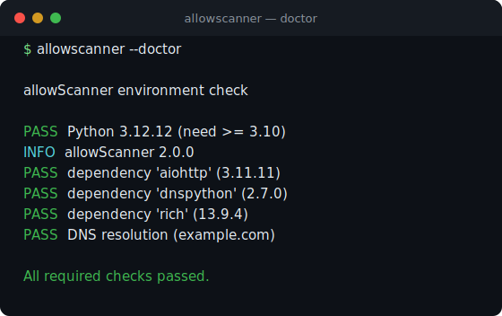
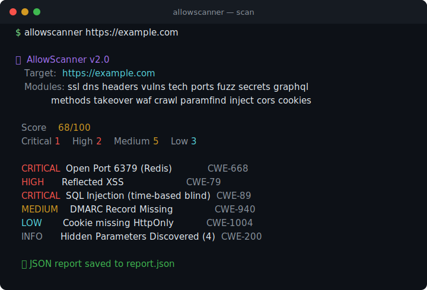

<div align="center">


# AllowScanner

### Fast, async web security scanner for pentesters and bug bounty hunters

[](https://github.com/0xgetz/allowScanner/actions/workflows/ci.yml)
[](https://pypi.org/project/allowscanner/)
[](https://python.org)
[](LICENSE)
[](Dockerfile)
[](https://mypy-lang.org/)
[](https://docs.astral.sh/ruff/)

One command, seventeen recon and security modules, a single 0–100 score. Async from top to bottom, no GUI, no signup, runs in CI.



</div>

---

## ✨ What it does

| Module | What it checks |
|---|---|
| 🔍 **Vulnerability scanner** | SQLi, XSS, SSRF, SSTI, Command Injection, XXE, Open Redirect, Directory Traversal |
| 📂 **Sensitive files** | `.env`, `.git`, `phpinfo.php`, Spring Actuator, Swagger, backup files, and more |
| 🔑 **Admin panels** | Discovers exposed admin / login interfaces |
| 🧭 **Content discovery** | Wordlist path fuzzing with soft-404 calibration; bring your own list with `--wordlist` |
| 🕸️ **Crawler / surface mapping** | Scope-aware BFS crawl that maps reachable pages, forms, and parameter names before testing |
| 🧪 **Parameter discovery** | Probes for hidden query params (Arjun-style) via reflection + status-change signals, bisected to stay low-noise |
| 🔌 **Port scan** | Async TCP connect scan of 25+ high-signal service ports (Redis, MongoDB, MySQL, Docker API, RDP, SMB…) |
| 🔑 **Secret & endpoint discovery** | Greps HTML and linked JS for leaked API keys, tokens, private keys, and hidden endpoints |
| 🧩 **GraphQL introspection** | Finds GraphQL endpoints and flags exposed introspection |
| 🚦 **HTTP method audit** | Detects dangerous verbs (PUT, DELETE, TRACE/XST, PATCH, CONNECT) |
| 💉 **Injection verification** | Confirms reflected XSS (unescaped vs encoded) and **blind SQLi** (boolean + time-based), re-checked to suppress false positives |
| 🛡️ **Security headers** | CSP, HSTS, X-Frame-Options, X-Content-Type-Options, Referrer-Policy, Permissions-Policy |
| 🔐 **SSL/TLS audit** | Certificate validity, expiry, SANs; **actively probes** for deprecated TLS 1.0/1.1 support and weak ciphers |
| 🧱 **WAF/CDN detection** | Fingerprints Cloudflare, Akamai, Imperva, Sucuri, F5, AWS, Fastly + active blocking probe |
| 🌐 **DNS security** | DNSSEC, SPF, DMARC, DKIM, CAA records |
| 🛠️ **Technology detection** | 30+ frameworks/servers: WordPress, React, Laravel, Nginx, Cloudflare, … |
| 🔎 **Subdomain enum** | DNS-based discovery from a curated common-prefix list |
| 🪝 **Subdomain takeover** | Flags dangling CNAMEs matching known unclaimed-service fingerprints |
| 🍪 **Cookie security** | Secure, HttpOnly, SameSite attribute checks |
| 🔗 **CORS analysis** | Wildcard, reflected origin, null origin, credentials misconfiguration |
| 📊 **Security score** | Single 0–100 score derived from finding severity |

Every module runs concurrently and degrades gracefully: one scanner failing never aborts the run.

## 🚀 Install

```bash
# From PyPI (recommended)
pip install allowscanner

# Isolated CLI install
pipx install allowscanner

# From source
git clone https://github.com/0xgetz/allowScanner.git
cd allowScanner
pip install -e .

# Or via make
make install      # runtime only
make dev          # with test + lint tooling
```

Requires Python 3.10+.

## ⚡ Quick start

```bash
# Full scan
allowscanner https://example.com

# Verify your environment before the first run
allowscanner --doctor

# JSON report for piping into other tools
allowscanner https://example.com -f json -o report.json

# Be polite: cap to 10 requests/sec, lower concurrency
allowscanner https://example.com --rate-limit 10 -c 20

# Content discovery with your own wordlist
allowscanner https://example.com --wordlist paths.txt

# Targeted port scan only
allowscanner https://example.com --only ports --ports 22,80,443,6379,27017

# Skip the noisy modules
allowscanner https://example.com --no-fuzz --no-subdomains

# Authenticated scan with a bearer token and a custom header
allowscanner https://app.example.com --bearer "$TOKEN" -H "X-Env: staging"

# Stay in scope, crawl the surface, and emit SARIF for code scanning
allowscanner https://example.com --scope example.com --exclude '/logout' -f sarif -o results.sarif

# Compare against a previous run and suppress known false positives
allowscanner https://example.com --baseline last.json --suppress .allowscanignore
```



### Docker

```bash
docker build -t allowscanner .
docker run --rm allowscanner https://example.com
```

## 📖 Usage

```
allowscanner [OPTIONS] URL

Options:
  -o, --output FILE       Save report to file
  -f, --format FORMAT     Output format: terminal | json | markdown | html | sarif
  -c, --concurrency N     Max concurrent requests (default: 50)
  -t, --timeout N         Request timeout in seconds (default: 15)
  -w, --wordlist FILE     Custom path-fuzzing wordlist (one path per line)
      --ports LIST        Comma-separated TCP ports to scan
  -v, --verbose           Verbose output
      --no-color          Disable colored output
      --no-ssl-verify     Disable TLS certificate verification (use with care)
      --log-file FILE     Write structured logs to a file
      --doctor            Run an environment self-test and exit

Auth & traffic:
  -H, --header "K: V"      Extra request header (repeatable)
      --cookie STRING     Cookie header value to send with every request
      --bearer TOKEN      Shortcut for an Authorization: Bearer header
  -r, --rate-limit N      Max requests/sec; auto-backs off on HTTP 429

Scope & surface:
      --scope HOST        Restrict to host(s) (repeatable)
      --exclude REGEX     Skip URLs matching regex (repeatable)
      --no-crawl          Skip the crawler / surface mapping
      --no-paramfind      Skip hidden-parameter discovery
      --no-inject         Skip injection verification (XSS / blind SQLi)

Triage:
      --suppress FILE     Drop findings matching an .allowscanignore file
      --baseline FILE     Diff findings against a prior JSON report

Module toggles:
  --no-ssl  --no-dns  --no-headers  --no-vulns  --no-admin  --no-sensitive
  --no-tech  --no-subdomains  --no-ports  --no-fuzz  --no-cors  --no-cookies
  --no-secrets  --no-graphql  --no-methods  --no-takeover  --no-waf  --no-paramfind  --no-inject
  --only MODULES          Run only these (comma-separated). Modules:
                          ssl, dns, headers, vulns, tech, subdomains, ports,
                          fuzz, secrets, graphql, methods, takeover, waf,
                          crawl, paramfind, inject, cors, cookies, admin, sensitive
```

## 📊 Example output




```
╭──── 📊 Scan Summary ─────────────────────────────────╮
│  Target: https://example.com                          │
│  Domain: example.com                                  │
│  Duration: 4.2s                                       │
│  Score: 68/100                                        │
╰──────────────────────────────────────────────────────╯

╭──── ⚠️ Vulnerability Summary ────────────────────────╮
│  Critical: 1  High: 2  Medium: 5  Low: 3             │
╰──────────────────────────────────────────────────────╯

╭──── 🔌 Open Ports (3) ───────────────────────────────╮
│  22  443  6379                                        │
╰──────────────────────────────────────────────────────╯

┌─── 🔍 Detailed Findings ─────────────────────────────┐
│ # │ Severity │ Finding                      │ CWE     │
│───┼──────────┼──────────────────────────────┼─────────│
│ 1 │ CRITICAL │ Open Port 6379 (Redis)       │ CWE-668 │
│ 2 │ HIGH     │ Reflected XSS                │ CWE-79  │
│ 3 │ MEDIUM   │ DMARC Record Missing         │ CWE-940 │
│ … │          │                              │         │
└──────────────────────────────────────────────────────┘
```

JSON output (`-f json`) includes every finding, the certificate, DNS records,
open ports, discovered subdomains, and the computed score, ready to pipe into
`jq` or a triage pipeline.

## 🧰 Tuning for real targets

- **Rate limiting** (`--rate-limit`): paces all HTTP requests to N/sec so you stay under WAF thresholds and don't hammer production.
- **Concurrency** (`-c`): how many requests run in parallel. Lower it on fragile targets, raise it for speed on robust ones.
- **Content discovery** (`--wordlist`): point it at any path wordlist (e.g. SecLists). The fuzzer calibrates against a random baseline first, so soft-404 catch-all pages don't flood the report.
- **Port scan** (`--ports`): override the default service-port set with your own comma-separated list.

## 🏗️ Project structure

```
src/allowscanner/
├── cli.py               # CLI entry point + argument handling
├── scanner.py           # Async orchestrator (gathers all modules)
├── output.py            # Rich terminal report
├── core/
│   ├── models.py        # Vulnerability, ScanResult, Severity, …
│   ├── config.py        # Validated scan configuration
│   ├── exceptions.py    # Exception hierarchy
│   ├── logging.py       # Structured logging + correlation IDs
│   ├── scope.py         # In-scope / exclude rules
│   ├── suppress.py      # .allowscanignore false-positive suppression
│   ├── diff.py          # Baseline diffing by finding fingerprint
│   └── doctor.py        # Environment self-test (--doctor)
├── scanners/
│   ├── http.py          # Async HTTP client + rate limiter
│   ├── vuln.py          # Injection / file / admin checks
│   ├── ssl.py           # TLS auditor
│   ├── dns.py           # DNS security checks
│   ├── headers.py       # Security header analysis
│   ├── tech.py          # Technology fingerprinting
│   ├── subdomain.py     # Subdomain enumeration
│   ├── ports.py         # TCP port scanner
│   ├── fuzz.py          # Content discovery / path fuzzing
│   ├── secrets.py       # JS/HTML secret + endpoint discovery
│   ├── graphql.py       # GraphQL introspection check
│   ├── methods.py       # HTTP method / verb audit
│   ├── takeover.py      # Subdomain takeover detection
│   ├── waf.py           # WAF / CDN detection
│   ├── crawler.py       # Scope-aware crawler / attack-surface mapper
│   ├── paramfind.py     # Hidden query-parameter discovery
│   ├── inject.py        # Context-aware XSS + blind SQLi verification
│   ├── cors.py          # CORS misconfiguration checks
│   └── cookies.py       # Cookie attribute checks
└── formatters/          # JSON / Markdown / HTML / SARIF output
```

## 🧪 Development

```bash
pip install -e ".[dev]"
ruff check src/ && ruff format --check src/
mypy src/allowscanner
pytest --cov=allowscanner
```

CI runs lint (Ruff), strict type-checking (mypy), the full test suite across
Python 3.10–3.13, and a Docker build on every push.

## 🗺️ Roadmap

The goal is to graduate from a *checklist scanner* into an **accurate, workflow-native** platform. Three axes, ordered by impact.

### ✅ Shipped

- 17 async recon/scan modules + a scope-aware **crawler / surface mapper**
- **Scope control** — host allowlist + path-regex excludes (`--scope`, `--exclude`)
- **Authenticated scanning** — `-H/--header`, `--cookie`, `--bearer`
- **Adaptive rate limiting** — honors HTTP 429 + `Retry-After`, auto-backs off
- **False-positive suppression** — `.allowscanignore` + stable per-finding fingerprint
- **SARIF output** (`-f sarif`) + a composite **GitHub Action** for code scanning
- **Baseline diff** (`--baseline`) — what's new since the last run
- **Parameter discovery (Arjun-style)** — finds hidden query params via reflection + status-change signals, bisected to stay low-noise
- **Injection verification** — context-aware reflected XSS (unescaped vs encoded) and **blind SQLi** (boolean + time-based), re-checked to drop false positives, fed by discovered params
- **Run-without-friction** — `allowscanner --doctor` env self-test, a `Makefile` (`make install/scan/test/check`), and friendly top-level error handling
- JSON / Markdown / HTML reports, Docker image, CI (ruff + mypy strict + pytest on 3.10–3.13)

### 🎯 Next — accuracy (what makes a scanner trusted, not binned)

- **OOB / out-of-band verification (interactsh-style)** — DNS/HTTP callback server to confirm *blind* SSRF, blind SQLi, RCE, and OOB XXE. The single biggest accuracy differentiator. Needs hosted or self-hosted callback infra, so it ships **opt-in**.

### 🎯 Next — coverage

- **Scripted login flows** — beyond static tokens: login + session refresh, since most real bugs live behind auth.
- **JS-rendered route discovery** — follow routes that only appear after client-side rendering.

### 🎯 Next — workflow & distribution

- **YAML template engine (nuclei-style)** — let the community write and share templates. The biggest long-term adoption lever; turns "our checks" into "everyone's platform." A standalone design commitment (schema, loader, execution sandbox).
- **Distribution** — PyPI (Trusted Publisher pending), multi-arch GHCR image, pre-commit hook, Homebrew tap, tagged releases + auto changelog.
- **Resume scan** — checkpoint and continue an interrupted run.

#### Honest caveats

- OOB needs a callback server (public interactsh or self-hosted): operational cost + ethics → opt-in only.
- Crawler + auth widen the surface you can trigger; both stay locked to scope with polite defaults.
- The template engine is a real design commitment, but once built it's the repo's largest asset.

## ⚠️ Responsible use

> **AllowScanner is for authorized security testing only.**
>
> - Scan only systems you own or have **explicit written permission** to test (a signed engagement, an in-scope bug bounty program, or your own infrastructure).
> - Active checks (injection payloads, port scans, content discovery) generate real traffic and can trip alerts or rate limits. Use `--rate-limit` and stay within program scope.
> - Unauthorized scanning may violate laws such as the CFAA, the UK Computer Misuse Act, and equivalents elsewhere. You are responsible for how you use this tool.
> - Practice responsible disclosure for anything you find.

## 📝 License

[MIT](LICENSE) © 2026 0xgetz
